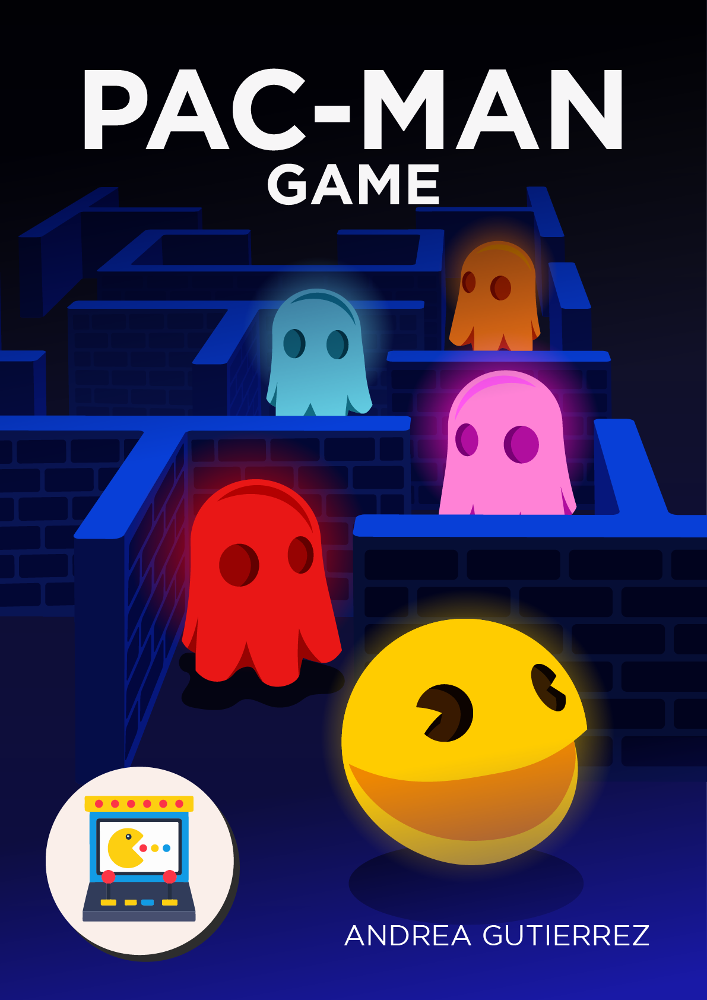
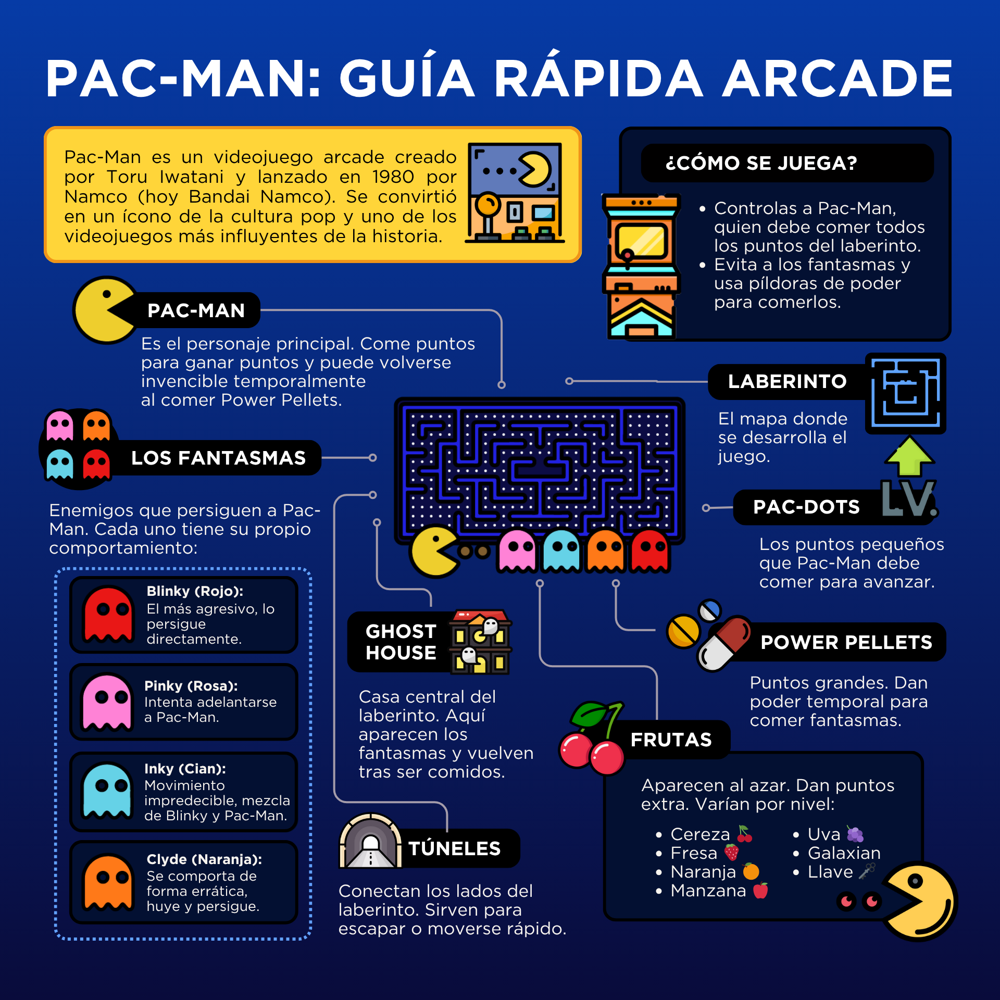
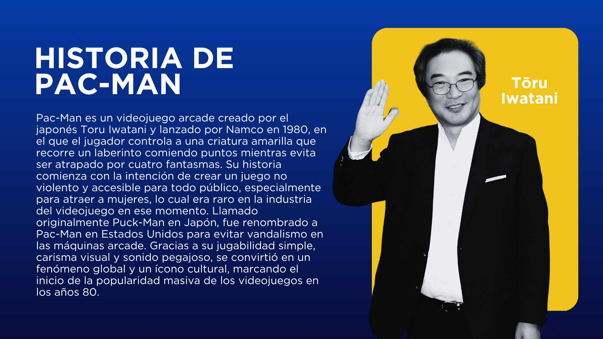
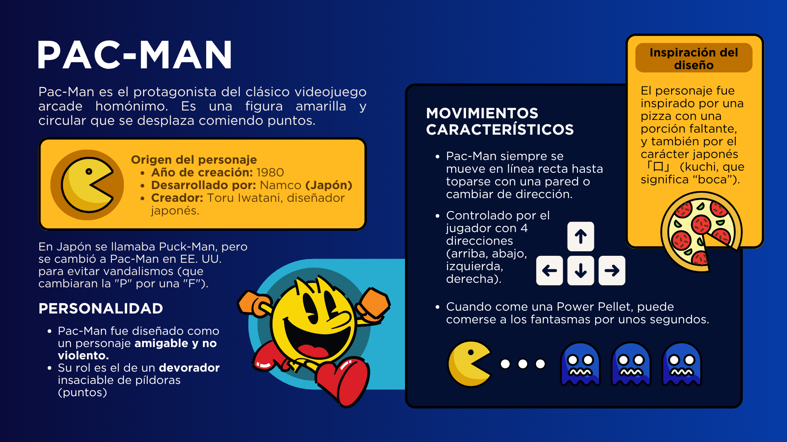
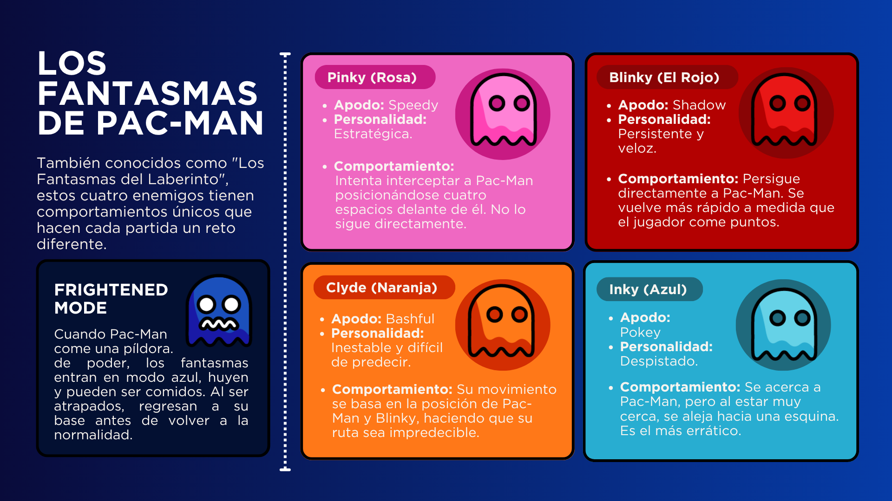
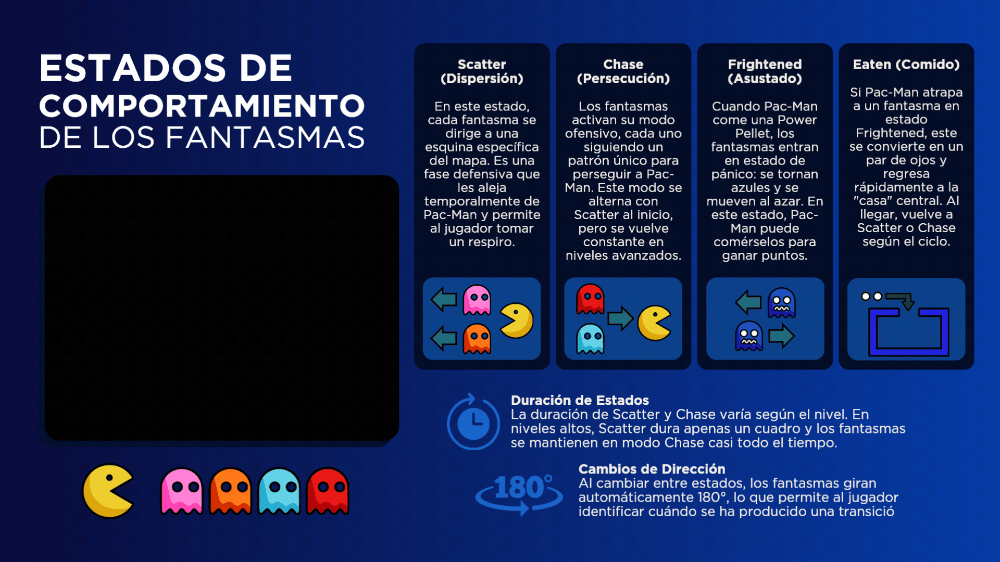
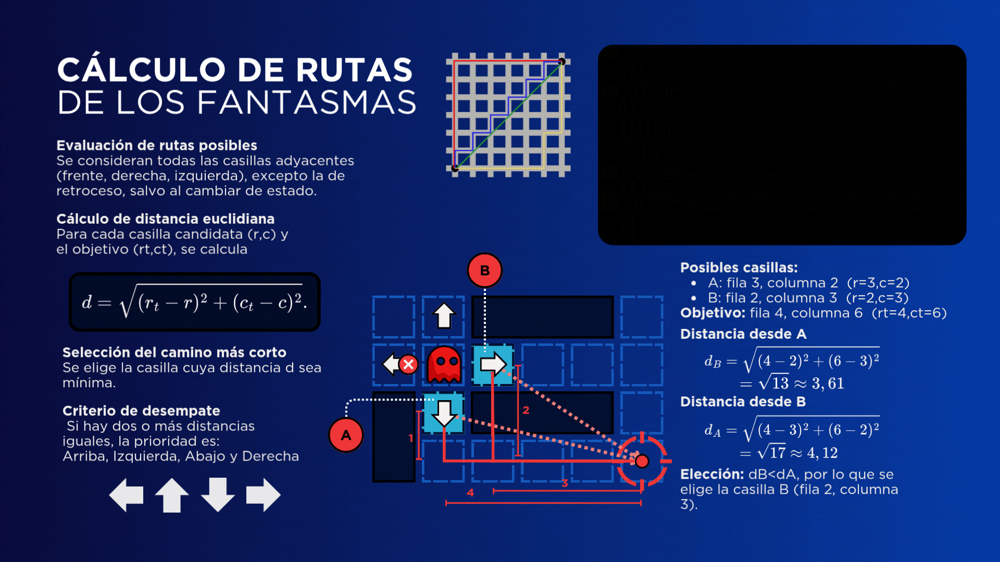
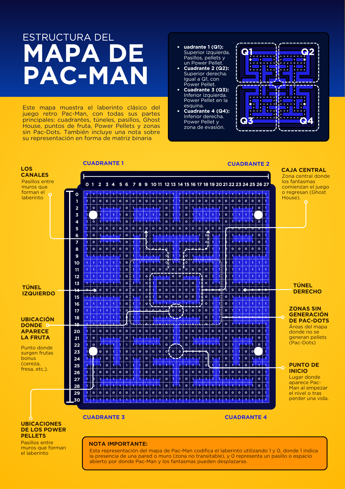
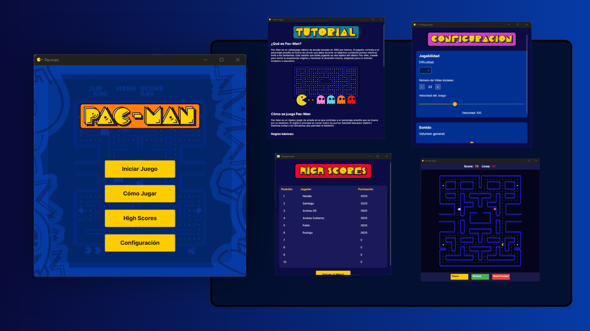
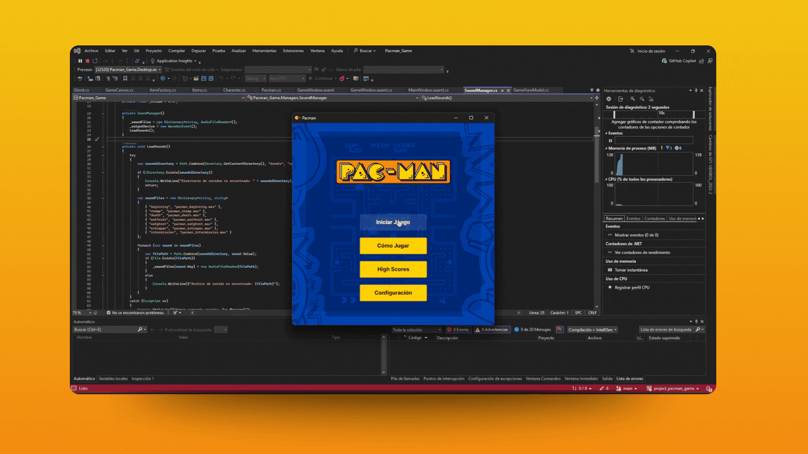

# Pac-Man Game

[](#)
[](#)



## Descripción del Proyecto

El proyecto consiste en la recreación del clásico juego Pac-Man como una aplicación de escritorio. El objetivo principal es demostrar el manejo de componentes visuales, interacción mediante eventos, animación de entidades, actualización de estados y uso de archivos para guardar y cargar información. El jugador controla a Pac-Man, un personaje esférico amarillo, cuyo propósito es consumir todas las píldoras energizantes dentro de un laberinto mientras evita ser atrapado por los fantasmas.

### Características

- Control del personaje Pac-Man mediante teclado.
- Movimiento restringido por las paredes del laberinto.
- Inteligencia artificial para el movimiento de los fantasmas.
- Consumo de píldoras y frutas que otorgan puntos y ventajas.
- Sistema de puntuación con guardado en archivo.
- Vidas limitadas y condiciones de finalización del juego.
- Pantalla de inicio con menú interactivo y tabla de puntajes.

## Guía de instalación y ejecución

Para obtener y ejecutar el proyecto, se seguirán los siguientes pasos:

1. **Clonar el repositorio** desde GitLab:

```bash
git clone https://gitlab.com/jala-university1/cohort-4/oficial-es-programaci-n-3-cspr-231.ga.t2.25.m1/secci-n-e/capstone/agutierrez/project_pacman_game
```
2. **Ingresar** a la carpeta del proyecto y **restaurar** las dependencias necesarias:

```bash
cd project_pacman_game
cd Pacman_Game
dotnet restore
```

3. **Compilar** y **ejecutar** el proyecto:

```bash
dotnet build
dotnet run --project Pacman_Game.csproj
```

4. Alternativamente, se podrá abrir el proyecto en un IDE como Visual Studio o Rider, desde donde se **configurará** la solución y se **ejecutará** la aplicación con un solo clic.

> .[!NOTE] Es importante asegurarse de que la carpeta `Assets` esté completa, ya que las imágenes, sonidos y tilesets se **cargarán** en tiempo de ejecución para que el juego funcione correctamente.

# ¿Qué es Pac-Man?

Pac-Man es un videojuego de laberinto lanzado en 1980 por Namco. En él, el jugador controla a un personaje amarillo con forma de disco redondo cuyo objetivo principal es comer todos los puntos del laberinto mientras evita a cuatro fantasmas enemigos. Al consumir las “Power Pellets” (píldoras grandes), Pac-Man puede devorar a los fantasmas temporalmente para obtener puntos extra.

Aunque sus gráficos en 8 bits y su mecánica parecen sencillos, Pac-Man destaca por su profundo diseño interno. Uno de los elementos más admirados es el comportamiento estratégico de los fantasmas, cada uno programado con una “personalidad” única a través de algoritmos específicos. Lejos de moverse al azar, sus acciones responden a reglas precisas, y en este documento exploraremos en detalle esos patrones de comportamiento, las decisiones de diseño y hasta errores de programación que, curiosamente, contribuyeron al encanto del juego.



## Historia

Pac-Man fue creado por Toru Iwatani con la intención de ofrecer un juego no violento y accesible para todos los públicos, especialmente pensado para atraer a las mujeres, algo poco común en la industria de los videojuegos de la época. Desde su lanzamiento, el juego se convirtió en un fenómeno cultural global, dando origen a secuelas, spin-offs y una enorme cantidad de merchandising. Su influencia ha perdurado, sirviendo de inspiración para generaciones de desarrolladores y jugadores.



## Mecánicas del Juego

### Objetivo Principal

El objetivo del juego es consumir todas las píldoras distribuidas en el laberinto. Estas incluyen píldoras pequeñas y super píldoras (o "Power Pellets"). Al comer una super píldora, Pac-Man obtiene temporalmente la capacidad de devorar fantasmas, quienes durante este estado cambian su color a azul y se vuelven vulnerables.

El jugador controla a Pac-Man usando las flechas del teclado. El movimiento es continuo mientras la tecla esté presionada (evento KeyDown), y está limitado por las paredes del laberinto. La partida avanza conforme se limpian los niveles de píldoras.

### Sistema de Acciones

| Acción | Efecto | Puntaje |
| --- | --- | --- |
| Consumir píldora pequeña | Incrementa puntaje | +10 pts |
| Consumir super píldora | Fantasmas vulnerables (azules) | +50 pts |
| Comer fantasma (azul) | Fantasma vuelve a la base | +200 pts cada |
| Consumir fruta | Vida extra / ralentiza fantasmas | Variable |
| Colisión con fantasma | Pierde una vida | - |

### Dinámica de Frutas

Durante la partida, aparecen frutas especiales de forma aleatoria en el laberinto. Estas ofrecen beneficios temporales como vidas extra o ralentización de los fantasmas, además de aportar puntos adicionales. Su aparición es breve, por lo que deben recogerse rápidamente

| Fruta | Puntos | Niveles | Efecto de juego |
| --- | --- | --- | --- |
| 🍒 Cereza | 100 | Nivel 1 | Otorga puntos extra |
| 🍓 Fresa | 300 | Nivel 2 | Otorga puntos extra |
| 🍊 Naranja | 500 | Niveles 3 y 4 | Otorga puntos extra |
| 🍎 Manzana | 700 | Niveles 5 y 6 | Otorga puntos extra |
| 🍈 Melón | 1 000 | Niveles 7 y 8 | Otorga puntos extra |
| 👾 Galaxian | 2 000 | Niveles 9 y 10 | Tributo al juego *Galaxian* |
| 🔔 Campana | 3 000 | Niveles 11 y 12 | Inspirada en *Mappy* (efecto de parálisis) |
| 🗝️ Llave | 5 000 | Nivel 13 en adelante (13+) | Puntuación máxima disponible |

## Personajes

### Pac-Man



Pac-Man es el protagonista del juego, controlado por el jugador. Es un círculo amarillo que se desplaza por el laberinto en las cuatro direcciones principales (arriba, abajo, izquierda y derecha). Su objetivo es consumir todas las píldoras y evitar a los fantasmas.

**Velocidades de Pac-Man**

| Nivel | Normal | Comiendo puntos | Modo “fright” | “Fright” comiendo puntos |
| --- | --- | --- | --- | --- |
| 1 | 80 % | ~71 % | 90 % | ~79 % |
| 2 – 4 | 90 % | ~79 % | 95 % | ~83 % |
| 5 – 20 | 100 % | ~87 % | 100 % | ~87 % |
| 21+ | 90 % | ~79 % | — | — |

> **Equivalencia absoluta:** 100 % ≃ 80 px/s; en Nivel 1, 80 % ≃ 64 px/s .
> 

### Fantasmas



Los fantasmas son los antagonistas controlados por la inteligencia artificial del juego. Cada fantasma tiene una estrategia de movimiento única para hacer la persecución más dinámica y desafiante:

| Fantasma | Estrategia | Descripción |
| --- | --- | --- |
| Blinky | Persigue directamente a Pac-Man | Sigue directamente a Pac-Man, siempre en su camino más corto. |
| Pinky | Intenta posicionarse 4 casillas delante | Intenta posicionarse 4 casillas delante de Pac-Man, anticipando su movimiento. |
| Inky | Usa la posición opuesta a Blinky para pinza | Su movimiento depende tanto de la posición de Pac-Man como de Blinky, resultando en patrones erráticos. |
| Clyde | Movimiento aleatorio o persigue si cerca | Alterna entre perseguir a Pac-Man y moverse aleatoriamente, dependiendo de su proximidad. |

Velocidades de los fantasmas

| Nivel | Normal | “Fright” | En túnel |
| --- | --- | --- | --- |
| 1 | 75 % | 50 % | 40 % |
| 2 – 4 | 85 % | 55 % | 45 % |
| 5 – 20 | 95 % | 60 % | 50 % |
| 21+ | 95 % | — | 50 % |

> **Nota:** En modo “fright” los fantasmas corren más lentos y cambian de color tras comer una pastilla de poder, y en los túneles laterales su velocidad se reduce casi a la mitad.
> 

## Inteligencia Artificial

### Comportamiento y Estados de los Fantasmas



Los fantasmas alternan entre tres estados principales que definen su comportamiento en el juego:

1. **Estado de Persecución (Chase):**
    
    Los fantasmas persiguen activamente a Pac-Man siguiendo patrones específicos que diferencian a cada uno, haciendo la persecución estratégica y dinámica.
    
2. **Estado de Dispersión (Scatter):**
    
    Los fantasmas se dirigen a su "esquina" asignada en el laberinto, dejando de perseguir a Pac-Man. Este estado brinda pausas temporales al jugador.
    
3. **Estado Asustado (Frightened):**
    
    Activado cuando Pac-Man consume una “Power Pellet”. Los fantasmas cambian a color azul, se mueven aleatoriamente y pueden ser devorados. La duración de este estado disminuye con el avance de niveles hasta desaparecer.
    
4. **Estado Comido (Eaten):**
    
    Los fantasmas se convierten en ojos y regresan a la casa central. Luego retoman su comportamiento anterior (scatter o chase).
    

> **Nota:** Al cambiar de estado, los fantasmas deben girar 180°, un detalle que el jugador puede aprovechar tácticamente.
> 

### Ciclo Temporal de Estados (segundos)

| Estado | Nivel 1 | Niveles 2–4 | Nivel 5+ |
| --- | --- | --- | --- |
| Dispersión | 7 | 7 | 5 |
| Persecución | 20 | 20 | 20 |
| Dispersión | 7 | 7 | 5 |
| Persecución | 20 | 20 | 20 |
| Dispersión | 5 | 5 | 5 |
| Persecución | 20 | 1033 | 1037 |
| Dispersión | 5 | 0.017 | 0.017 |
| Persecución | Indefinido | Indefinido | Indefinido |

### Algoritmo de Movimiento de los Fantasmas

Los fantasmas se mueven siguiendo un algoritmo basado en metas y evaluación de rutas dentro de una cuadrícula que representa el laberinto. Su movimiento se decide en los cruces, donde evalúan las opciones disponibles.

### Pasos del Algoritmo

1. **Evaluación de rutas posibles** desde la posición actual (excluyendo retroceso, salvo al cambiar de estado).
2. **Cálculo de distancia euclidiana** entre cada ruta y la meta asignada según el fantasma y estado.
3. **Selección del camino con menor distancia.**
4. En caso de empate, se prioriza la dirección: **Arriba > Izquierda > Abajo > Derecha.**

> **Nota:** Los fantasmas no pueden moverse hacia atrás (la dirección opuesta a la que están mirando), salvo al cambiar de estado.
> 



### Patrones Individuales de Fantasmas

Cada fantasma tiene un patrón único basado en una meta (objetivo) calculada según la posición de Pac-Man y otros factores, que define su estrategia y comportamiento en el juego.

### Blinky (Fantasma Rojo)

.gif)

- **Meta:** Posición exacta de Pac-Man.
- **Comportamiento:** Agresivo y directo, persigue constantemente a Pac-Man.
- **Fase especial “Elroy”:**
    - Cuando quedan ≤ 20 bolitas, su velocidad aumenta.
    - Con ≤ 10 bolitas, se vuelve aún más rápido, superando a Pac-Man en niveles avanzados.

### Pinky (Fantasma Rosa)

.gif)

- **Meta:** Cuatro casillas adelante de la dirección hacia donde mira Pac-Man.
- **Error de programación:** Si Pac-Man mira hacia arriba, la meta se desplaza cuatro casillas a la izquierda debido a un desbordamiento del procesador Z80.
- **Estrategia:** Busca emboscar a Pac-Man anticipando su movimiento frontal.
- **Nota:** Fácil de manipular por jugadores expertos debido a su predictibilidad.

### Inky (Fantasma Azul)

.gif)

- **Meta:** Punto calculado en función de la posición de Pac-Man y Blinky:
    1. Se ubica un punto dos casillas frente a Pac-Man.
    2. Se traza un vector desde Blinky hacia ese punto y se extiende igual distancia en sentido contrario.
- **Resultado:** Movimiento errático e impredecible, depende de la cercanía a Blinky.

### Clyde (Fantasma Naranja)

.gif)

- **Meta:** Posición de Pac-Man si está a más de 8 casillas.
- **Comportamiento:**
    - Si está a 8 casillas o menos, se retira a su esquina asignada.
    - Oscila entre persecución y dispersión, dificultando predecir sus movimientos.
- **Estrategia:** Más fácil de evadir que otros fantasmas.

## Elementos del Juego



### Diseño y Estructura del Tablero

El tablero de Pac-Man está compuesto por un laberinto fijo, diseñado sobre una cuadrícula, que incluye:

- **Paredes:** Obstáculos que delimitan el recorrido y bloquean el paso tanto de Pac-Man como de los fantasmas.
- **Puntos pequeños:** Distribuidos uniformemente para que Pac-Man los consuma.
- **Super píldoras:** Puntos grandes ubicados en posiciones estratégicas, que al ser consumidos activan el estado asustado de los fantasmas.
- **Frutas (opcional):** Aparecen aleatoriamente para otorgar puntos extra o efectos especiales.

Este laberinto constituye el espacio donde se desarrollan todas las interacciones y la lógica del juego.

```csharp
int[,] pacmanMap = new int[,]
{
    {1, 1, 1, 1, 1, 1, 1, 1, 1, 1, 1, 1, 1, 1, 1, 1, 1, 1, 1, 1, 1, 1, 1, 1, 1, 1, 1, 1},
    {1, 0, 0, 0, 0, 0, 0, 0, 0, 0, 0, 0, 0, 1, 1, 0, 0, 0, 0, 0, 0, 0, 0, 0, 0, 0, 0, 1},
    {1, 0, 1, 1, 1, 1, 0, 1, 1, 1, 1, 1, 0, 1, 1, 0, 1, 1, 1, 1, 1, 0, 1, 1, 1, 1, 0, 1},
    {1, 0, 1, 1, 1, 1, 0, 1, 1, 1, 1, 1, 0, 1, 1, 0, 1, 1, 1, 1, 1, 0, 1, 1, 1, 1, 0, 1},
    {1, 0, 1, 1, 1, 1, 0, 1, 1, 1, 1, 1, 0, 1, 1, 0, 1, 1, 1, 1, 1, 0, 1, 1, 1, 1, 0, 1},
    {1, 0, 0, 0, 0, 0, 0, 0, 0, 0, 0, 0, 0, 0, 0, 0, 0, 0, 0, 0, 0, 0, 0, 0, 0, 0, 0, 1},
    {1, 0, 1, 1, 1, 1, 0, 1, 1, 0, 1, 1, 1, 1, 1, 1, 1, 1, 0, 1, 1, 0, 1, 1, 1, 1, 0, 1},
    {1, 0, 1, 1, 1, 1, 0, 1, 1, 0, 1, 1, 1, 1, 1, 1, 1, 1, 0, 1, 1, 0, 1, 1, 1, 1, 0, 1},
    {1, 0, 0, 0, 0, 0, 0, 1, 1, 0, 0, 0, 0, 1, 1, 0, 0, 0, 0, 1, 1, 0, 0, 0, 0, 0, 0, 1},
    {1, 1, 1, 1, 1, 1, 0, 1, 1, 1, 1, 1, 0, 1, 1, 0, 1, 1, 1, 1, 1, 0, 1, 1, 1, 1, 1, 1},
    {1, 1, 1, 1, 1, 1, 0, 1, 1, 1, 1, 1, 0, 1, 1, 0, 1, 1, 1, 1, 1, 0, 1, 1, 1, 1, 1, 1},
    {1, 1, 1, 1, 1, 1, 0, 1, 1, 0, 0, 0, 0, 0, 0, 0, 0, 0, 0, 1, 1, 0, 1, 1, 1, 1, 1, 1},
    {1, 1, 1, 1, 1, 1, 0, 1, 1, 0, 1, 1, 1, 0, 0, 1, 1, 1, 0, 1, 1, 0, 1, 1, 1, 1, 1, 1},
    {1, 1, 1, 1, 1, 1, 0, 1, 1, 0, 1, 0, 0, 0, 0, 0, 0, 1, 0, 1, 1, 0, 1, 1, 1, 1, 1, 1},
    {0, 0, 0, 0, 0, 0, 0, 0, 0, 0, 1, 0, 0, 0, 0, 0, 0, 1, 0, 0, 0, 0, 0, 0, 0, 0, 0, 0},
    {1, 1, 1, 1, 1, 1, 0, 1, 1, 0, 1, 0, 0, 0, 0, 0, 0, 1, 0, 1, 1, 0, 1, 1, 1, 1, 1, 1},
    {1, 1, 1, 1, 1, 1, 0, 1, 1, 0, 1, 1, 1, 1, 1, 1, 1, 1, 0, 1, 1, 0, 1, 1, 1, 1, 1, 1},
    {1, 1, 1, 1, 1, 1, 0, 1, 1, 0, 0, 0, 0, 0, 0, 0, 0, 0, 0, 1, 1, 0, 1, 1, 1, 1, 1, 1},
    {1, 1, 1, 1, 1, 1, 0, 1, 1, 0, 1, 1, 1, 1, 1, 1, 1, 1, 0, 1, 1, 0, 1, 1, 1, 1, 1, 1},
    {1, 1, 1, 1, 1, 1, 0, 1, 1, 0, 1, 1, 1, 1, 1, 1, 1, 1, 0, 1, 1, 0, 1, 1, 1, 1, 1, 1},
    {1, 0, 0, 0, 0, 0, 0, 0, 0, 0, 0, 0, 0, 1, 1, 0, 0, 0, 0, 0, 0, 0, 0, 0, 0, 0, 0, 1},
    {1, 0, 1, 1, 1, 1, 0, 1, 1, 1, 1, 1, 0, 1, 1, 0, 1, 1, 1, 1, 1, 0, 1, 1, 1, 1, 0, 1},
    {1, 0, 1, 1, 1, 1, 0, 1, 1, 1, 1, 1, 0, 1, 1, 0, 1, 1, 1, 1, 1, 0, 1, 1, 1, 1, 0, 1},
    {1, 0, 0, 0, 1, 1, 0, 0, 0, 0, 0, 0, 0, 0, 0, 0, 0, 0, 0, 0, 0, 0, 1, 1, 0, 0, 0, 1},
    {1, 1, 1, 0, 1, 1, 0, 1, 1, 0, 1, 1, 1, 1, 1, 1, 1, 1, 0, 1, 1, 0, 1, 1, 0, 1, 1, 1},
    {1, 1, 1, 0, 1, 1, 0, 1, 1, 0, 1, 1, 1, 1, 1, 1, 1, 1, 0, 1, 1, 0, 1, 1, 0, 1, 1, 1},
    {1, 0, 0, 0, 0, 0, 0, 1, 1, 0, 0, 0, 0, 1, 1, 0, 0, 0, 0, 1, 1, 0, 0, 0, 0, 0, 0, 1},
    {1, 0, 1, 1, 1, 1, 1, 1, 1, 1, 1, 1, 0, 1, 1, 0, 1, 1, 1, 1, 1, 1, 1, 1, 1, 1, 0, 1},
    {1, 0, 1, 1, 1, 1, 1, 1, 1, 1, 1, 1, 0, 1, 1, 0, 1, 1, 1, 1, 1, 1, 1, 1, 1, 1, 0, 1},
    {1, 0, 0, 0, 0, 0, 0, 0, 0, 0, 0, 0, 0, 0, 0, 0, 0, 0, 0, 0, 0, 0, 0, 0, 0, 0, 0, 1},
    {1, 1, 1, 1, 1, 1, 1, 1, 1, 1, 1, 1, 1, 1, 1, 1, 1, 1, 1, 1, 1, 1, 1, 1, 1, 1, 1, 1},
};

```

### Escondite Secreto (Zona de Inmunidad)

En el diseño del mapa existen ubicaciones específicas donde Pac-Man puede evadir a los fantasmas bajo ciertas condiciones:

- Zonas donde los fantasmas no pueden girar hacia arriba debido a restricciones del algoritmo de movimiento.
- Estados y orientaciones específicas de los fantasmas que limitan su acceso a estas áreas.

Este comportamiento es resultado de reglas internas del algoritmo de IA, generando un "escondite" que puede ser explotado estratégicamente.

## Bugs Documentados

### Comportamientos Inesperados en Fantasmas

- **Blinky:** Puede quedar atrapado en el túnel cercano al escondite debido a restricciones del mapa.
- **Pinky:** Presenta un bug cuando Pac-Man mira hacia arriba; su meta se desplaza erróneamente, impidiéndole alcanzar a Pac-Man.
- **Inky:** Si Blinky queda atascado, Inky también puede bloquearse, dado que su cálculo de objetivo depende de la posición de Blinky.
- **Clyde:** Cuando está lejos del escondite o en ruta a su esquina, su amenaza disminuye considerablemente.

**Nota:** La efectividad del escondite disminuye cuando los fantasmas están en estado de dispersión, ya que sus rutas se modifican y pueden atacar desde distintas direcciones.

### Error de Cálculo en Pinky e Inky

El bug se origina en el procesador Z80 de 8 bits que maneja coordenadas de 16 bits usando registros dobles. Al calcular la meta de Pinky mediante multiplicación de vectores unitarios, el sistema interpreta estas coordenadas como un solo número en lugar de dos valores separados. Esto genera un desbordamiento que desplaza la posición meta, especialmente cuando Pac-Man mira hacia arriba.

Dado que Inky depende parcialmente del mismo sistema de coordenadas para su cálculo, también se ve afectado por este error, generando movimientos erráticos.

## Progreso y Puntuación

### Mecánica de Puntos

La puntuación se actualiza en tiempo real y se muestra en la esquina superior izquierda de la pantalla. Cada acción de Pac-Man incrementa el puntaje según una tabla predefinida (consumo de píldoras, fantasmas, frutas, etc.).

El puntaje final se guarda al concluir el juego, junto con el seudónimo ingresado por el jugador. Estos registros se almacenan en un archivo de texto para mantener un historial de mejores marcas.

### Condición de Fin del Juego

El juego termina cuando Pac-Man pierde todas sus vidas o completa el último nivel en modo historia. En modo supervivencia, el juego avanza indefinidamente con niveles sucesivos.

Al finalizar, se muestra un mensaje con opciones para reiniciar la partida o regresar a la pantalla principal.

## Interfaz de Usuario



### Pantalla de Inicio

La pantalla inicial presenta un menú interactivo con las siguientes opciones:

- **Iniciar Juego:** Inicia una nueva partida y carga el tablero.
- **Score Board:** Muestra la tabla de puntajes guardados, cargada estáticamente o desde un archivo JSON.
- **Controles:** Despliega las instrucciones y configuración de teclas para el jugador.
- **Salir:** Cierra la aplicación.
- **Mute (opcional):** Activa o desactiva el sonido y música del juego sin guardar preferencias.

Todas las opciones incluyen efectos sonoros para mejorar la experiencia del usuario.

### Tabla de Puntajes

La tabla de puntajes almacena y presenta los registros de mejores marcas junto con los seudónimos de los jugadores, recuperados desde almacenamiento local (archivo de texto o JSON).

# **Ejecución del Proyecto**
